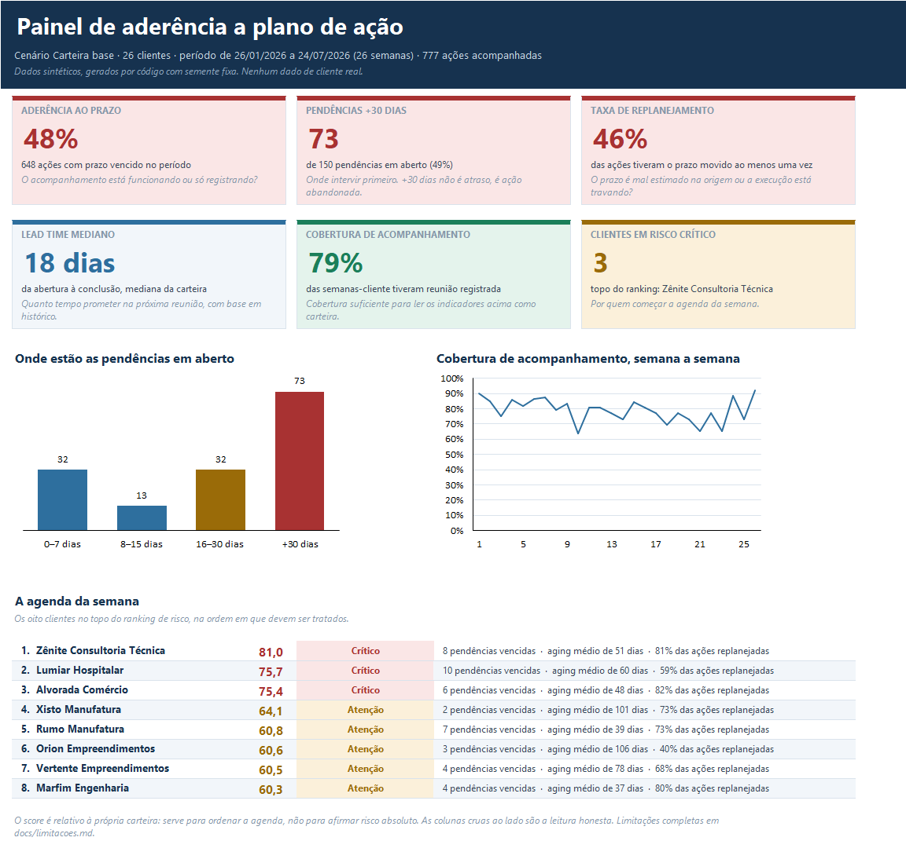

# Painel de aderência a plano de ação

**Toda consultoria tem plano de ação. Quase nenhuma mede se o plano anda.**

Esta ferramenta gera dados sintéticos de uma carteira de clientes com planos de ação e devolve, em
Excel, os seis indicadores que respondem se o acompanhamento está funcionando — cada um com a
pergunta de decisão que ele governa escrita ao lado.

---

## O problema

Plano de ação é uma lista de ações, com responsável e prazo, revisada em reunião semanal. Todo
mundo tem a lista. Quase ninguém mede se a lista anda.

Quantas ações foram concluídas até o prazo prometido? Quanto tempo uma pendência fica em aberto
antes de ser resolvida? Quantas vezes um prazo é reprogramado antes de virar entrega? Quais
clientes estão acumulando atraso e precisam de atenção antes da próxima reunião?

Sem esses números, a reunião semanal decide por percepção. É opinião com sotaque técnico.

A ideia nasceu da rotina de acompanhamento semanal de planos de ação em uma carteira de 26
clientes. O projeto **não usa dado de cliente**: ele modela o processo e gera dados sintéticos
para provar que a medição é possível.

---

## Os indicadores

Esta é a seção mais importante do arquivo. Regra que governa a lista: **indicador que ninguém usa
é enfeite.** Se não der para escrever a pergunta de decisão ao lado, o indicador sai.

| Indicador | Cálculo | Pergunta de decisão que responde |
|---|---|---|
| **Aderência ao prazo** | ações concluídas até o prazo **original** ÷ ações com prazo original vencido no período | O acompanhamento está funcionando ou só registrando? |
| **Aging de pendências** | dias em aberto, em faixas: 0–7, 8–15, 16–30, +30 | Onde intervir primeiro. Pendência de +30 dias não é atraso, é ação abandonada |
| **Taxa de replanejamento** | ações com ao menos uma reprogramação ÷ total de ações | O prazo está sendo mal estimado na origem ou a execução está travando? |
| **Lead time de conclusão** | mediana de dias entre abertura e conclusão, por categoria | Quanto tempo prometer na próxima reunião, com base em histórico |
| **Cobertura de acompanhamento** | clientes com atualização registrada na semana ÷ total da carteira | Sem cobertura, todos os indicadores acima perdem representatividade |
| **Ranking de risco por cliente** | composição de pendências vencidas, aging médio e replanejamento | Ordem de prioridade da agenda da semana |

A **cobertura** é o indicador que mede o próprio processo de medição. Ela existe porque número
bonito sobre base incompleta engana: aderência de 80% sobre cobertura de 55% não é uma carteira
com boa aderência — é uma carteira em que metade dos clientes não foi acompanhada.

Definição, fórmula e justificativa de cada um em [docs/indicadores.md](docs/indicadores.md).

---

## O painel



*Aba Resumo, capturada da própria planilha. Os seis indicadores em leitura única, cada um com a
pergunta de decisão embaixo, e a agenda da semana já ordenada.*

A pasta de trabalho tem sete abas, na ordem de leitura de quem decide:

| Aba | O que traz |
|---|---|
| **Resumo** | os seis indicadores da carteira, em painel de leitura única |
| **Aderência por cliente** | ordenada da pior para a melhor |
| **Aging** | pendências por faixa de dias, com as +30 destacadas, e a lista completa em aberto |
| **Replanejamento** | por cliente e por categoria de ação |
| **Lead time** | mediana, dispersão e prometido versus realizado, por categoria |
| **Ranking de risco** | a agenda da semana, em ordem |
| **Base** | tabela achatada, pronta para Power BI ou tabela dinâmica |

Cabeçalho congelado, filtro automático, percentual como percentual, data como data. Nenhuma
célula com número cru sem rótulo.

**Quem não vai rodar nada** encontra a planilha pronta em
[exemplos/relatorio_exemplo.xlsx](exemplos/relatorio_exemplo.xlsx) e as imagens em
[exemplos/prints/](exemplos/prints/).

---

## Como rodar

```bash
pip install -r requirements.txt
python src/main.py
```

O arquivo sai em `saida/painel_aderencia.xlsx`, junto com os CSVs da base e as imagens do painel.
Para conferir os cálculos, `python src/validacao.py` recalcula os seis indicadores em Python puro
e compara com a rotina oficial.

Os parâmetros de cenário ficam em [config.yaml](config.yaml) — número de clientes, horizonte,
prazo prometido e tempo real de execução por categoria, probabilidade de reunião semanal, pesos do
score de risco. Mudar um número e ver o indicador reagir é o que transforma relatório em ferramenta
de decisão.

---

## Decisões de modelagem

As inteiras estão em [docs/decisoes.md](docs/decisoes.md). As quatro que mais mudam o resultado:

**Aderência é medida contra o prazo original, nunca contra o reprogramado.** Medir contra o prazo
atual é medir contra um alvo que se move: se toda reprogramação redefine a régua, a aderência tende
a 100% e o indicador para de informar. O prazo atual serve para operar a semana; o original, para
medir.

**Aging em faixas, não em média.** A média mistura a ação aberta ontem com a ação parada há quatro
meses e devolve um número que não descreve nenhuma das duas. As faixas mostram a cauda, e a cauda
é o problema.

**Lead time em mediana, não em média — e com uma segunda coluna.** A distribuição tem cauda longa
à direita; a média é puxada pela cauda e descreve um caso que quase não acontece. Mas a mediana só
enxerga ações que fecharam, e as que mais demoram são justamente as que ainda não fecharam: no
cenário base isso é forte a ponto de aparecer categoria "entregando antes do prometido" numa
carteira que cumpre menos da metade dos prazos. Por isso existe a coluna `mediana_com_pendentes`,
que conta cada pendência pelo tempo já decorrido e serve de limite inferior honesto.

**Ação nasce em reunião.** A base de acompanhamentos é gerada antes da base de ações, e uma ação
só pode ser aberta em uma semana em que houve reunião. Cliente com agenda irregular gera menos
ações e as vê envelhecer — o efeito da cobertura sobre os outros indicadores emerge do modelo, em
vez de ser forçado por parâmetro.

---

## Limitações declaradas

A lista completa está em [docs/limitacoes.md](docs/limitacoes.md). O essencial:

- **Os dados são sintéticos.** Nenhum número descreve empresa real. O projeto demonstra o método
  de medição, não um diagnóstico de mercado.
- **A modelagem de comportamento é premissa, não medição.** Que 7% das ações sejam abandonadas ou
  que Processo leve mais que Comercial são hipóteses declaradas no `config.yaml`, não estimativas
  extraídas de amostra.
- **Não afirma ganho de eficiência.** Não há medição antes e depois em operação real. A tese é
  sobre tornar visível, não sobre melhorar.
- **O score de risco é relativo à carteira.** Serve para ordenar a agenda, nunca para afirmar
  risco absoluto.
- **Cancelamento sai dos denominadores, e isso é gamificável.** Quem quiser subir a aderência sem
  melhorar a execução pode cancelar em massa. O painel mostra o total de cancelamentos ao lado da
  aderência para que a manobra fique visível.

---

## Próximo indicador a construir

**Reincidência de tema** — fração de ações abertas que tratam de assunto já tratado em ação
anterior concluída para o mesmo cliente.

Responde: *a ação foi concluída ou só foi fechada?* É o indicador que separa entrega de
encerramento administrativo — o caso em que a aderência sobe e o problema continua no mesmo lugar.
Ficou fora desta versão porque exige um campo de tema padronizado que o gerador atual não modela.

---

## Stack

Python · Pandas · NumPy · openpyxl · PyYAML · matplotlib. Sem framework, sem banco, sem
hospedagem. Roda com um comando.

```
config.yaml       parâmetros de cenário
src/
  main.py         ponto de entrada: gera, calcula, exporta
  gerador.py      dados sintéticos, semente fixa
  indicadores.py  uma função por indicador
  relatorio.py    montagem e formatação do Excel
  prints.py       imagens do painel
  validacao.py    recálculo independente, em Python puro
docs/             indicadores, decisões de modelagem, limitações, publicação
ferramentas/      extração do print da aba Resumo, direto do Excel
exemplos/         planilha versionada e prints, para quem não vai rodar
```

O relatório é reproduzível: a semente é fixa, e a mesma semente devolve exatamente o mesmo arquivo.

---

Projeto autoral de **Bernardo Paranhos**.
